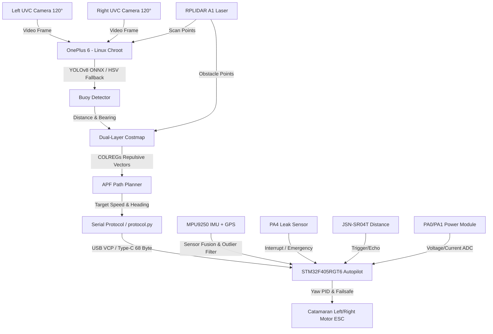
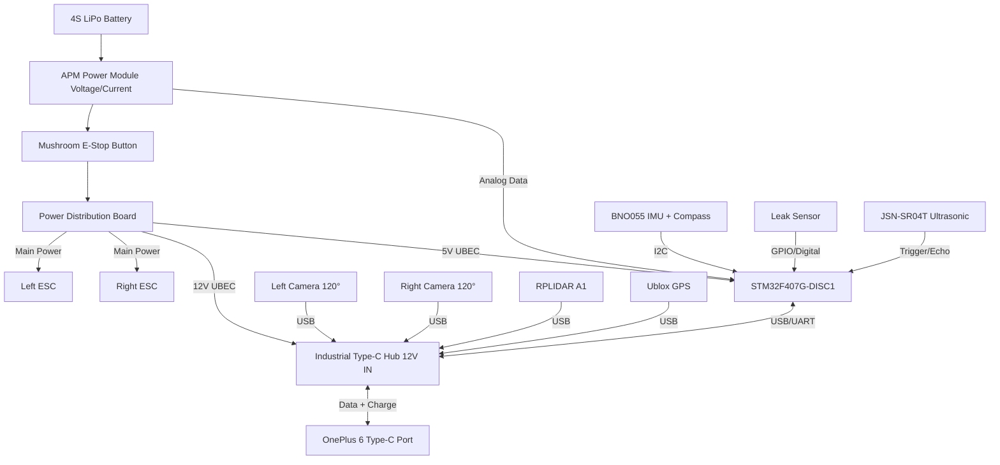

# Beebot - Autonomous Surface Vehicle (ASV) Autonomous Control and Navigation System

[Türkçe Sürüm / Turkish Version](README_TR.md)

This project is a complete autonomous navigation and control software suite fully compliant with the **TEKNOFEST 2026 Autonomous Surface Vehicle (ASV) Specifications**. It runs on a **OnePlus 6 (High-Level Autonomy)** and **STM32F405RGT6 (Low-Level Autopilot)** hardware architecture, and features dual UVC wide-angle cameras (240° field of view), an RPLIDAR A1 laser scanner (360° obstacle detection), hardware water leak protection, a front-facing waterproof ultrasonic sensor, and a power module for active current/voltage monitoring.

---

## 🛠️ Technology Stack

The system is built on a layered technology stack to satisfy demanding resource management, processing throughput, and hardware safety constraints:

### 1. High-Level Autonomy Layer (OnePlus 6 / Linux Chroot)
* **Perception Hardware:**
  * **Dual UVC Wide-Angle Cameras:** Left and right front cameras with angular offset correction (-60° and +60° respectively) delivering a combined 240-degree field of view.
  * **RPLIDAR A1 2D Laser Scanner:** 360-degree laser range scanning with a 12-meter range for real-time costmap integration.
* **Operating System / Runtime Environment:**
  * **Ubuntu Base 22.04 LTS (ARM64):** A minimal, high-performance Linux root filesystem (Chroot) running inside Termux.
  * **Termux & Termux:Boot:** Auto-boot infrastructure that executes the autonomy software immediately upon device power-up.
  * **Android System Tweaks:** Custom ADB Window Manager (`window manager`) and screen density (`density`) optimizations, with Magisk background service locks to prevent CPU throttling.
* **Programming Language:** Python 3.10
* **Libraries and Frameworks:**
  * **OpenCV DNN (Headless):** Camera stream grabbing, video logging, and deep learning model inference accelerated on the GPU (Adreno 630 OpenCL).
  * **NumPy:** High-speed matrix operations, egocentric costmap updates, and potential field vector calculations.
  * **PySerial:** Asynchronous, low-latency serial communication with auto-reconnect capabilities.
  * **Ultralytics YOLOv8 (ONNX):** Lightweight, optimized deep learning model inference for buoy detection.

### 2. Low-Level Control Layer (STM32F405RGT6 / Bare-Metal)
* **Operating System:** FreeRTOS (Ensures deterministic multi-task scheduling and real-time safety).
* **Programming Language:** Bare-Metal C (C99 Standard)
* **Hardware Acceleration, Sensors & Optimizations:**
  * **Water Leak Sensor:** Submersion type leak detection monitored via pin `PA4` with hardware-latching motor cut-off.
  * **JSN-SR04T Waterproof Ultrasonic Sensor:** Front distance measurement (up to 4.5 meters) driven via `PA5` (Trigger) and `PB0` (Echo).
  * **Power Module (Current & Voltage):** Battery health and load monitoring via ADC channels `PA0` (Current) and `PA1` (Voltage).
  * **STM32 FPU (Floating Point Unit):** Hardware-accelerated floating-point PID calculations enabled via SCB CPACR registers.
  * **ART Accelerator (Flash Cache/Prefetch):** Zero-wait-state Flash memory execution at a 168 MHz SYSCLK frequency.
  * **DMA (Direct Memory Access):** Non-blocking USART circular ring buffer using DMA transfers (tracked via the NDTR register) to receive serial packets with zero CPU overhead.
  * **CRC16-ANSI:** Computes standard polynomial checksums to verify communication packet integrity.

### 3. Simulation and Testing Infrastructure
* **SITL (Software-in-the-Loop) Simulator:** A 2D OpenCV/Python physics simulator modeling catamaran thruster dynamics, hydrodynamics drag, water currents, wind forces, and virtual camera FOV boundaries.

---

## 🛠️ System Architecture and Data Flow



---

## 🔌 Hardware Connection Schematic



---

## 📊 Work Breakdown and Task Allocation Matrix

Detailed breakdown of high-level and low-level software responsibilities, mapped directly to their respective source files and class components:

| Module / Feature | Sub-task | Source File / Class | Layer | Description |
| :--- | :--- | :--- | :--- | :--- |
| **Perception** | YOLO Model Inference | [detector.py](file:///c:/Users/Şahakan/Desktop/aydede/high_level/src/detector.py) -> `BuoyDetector.detect()` | High-Level (Python) | Runs YOLOv8 ONNX model to extract real-time buoy bounding boxes. |
| | Multi-Camera Management | [main.py](file:///c:/Users/Şahakan/Desktop/aydede/high_level/src/main.py) -> `VideoGrabber` | High-Level (Python) | Captures frames from multiple cameras and applies angular offsets to align buoy bearings. |
| | LIDAR Scan Ingestion | [main.py](file:///c:/Users/Şahakan/Desktop/aydede/high_level/src/main.py) -> `LidarWorker` | High-Level (Python) | Asynchronously reads RPLIDAR A1 scans and registers obstacle points to the costmap. |
| | HSV Color Segmentation | [detector.py](file:///c:/Users/Şahakan/Desktop/aydede/high_level/src/detector.py) -> `BuoyDetector.hsv_fallback()` | High-Level (Python) | Fallback algorithm using HSV thresholding during low-light or glare conditions. |
| | Lens Obstruction Check | [detector.py](file:///c:/Users/Şahakan/Desktop/aydede/high_level/src/detector.py) -> `BuoyDetector.check_lens_obstruction()` | High-Level (Python) | Monitors camera lens for blockage, dirt, or water splash using contrast analysis. |
| | Temporal Validation | [detector.py](file:///c:/Users/Şahakan/Desktop/aydede/high_level/src/detector.py) -> `TemporalFilter` | High-Level (Python) | Filters out high-frequency glare noise or wave occlusion using multi-frame rolling validation. |
| **Mapping** | Costmap Grid Update | [costmap.py](file:///c:/Users/Şahakan/Desktop/aydede/high_level/src/costmap.py) -> `LocalCostmap.update()` | High-Level (Python) | Maps camera and LIDAR detections into an egocentric 2D local occupancy grid map. |
| | Gate Forces (Symmetric) | [costmap.py](file:///c:/Users/Şahakan/Desktop/aydede/high_level/src/costmap.py) -> `LocalCostmap.get_gate_forces()` | High-Level (Python) | Computes attractive/centering vector fields when passing through red/green gate-buoy pairs. |
| | Obstacle Repulsion (COLREGs) | [costmap.py](file:///c:/Users/Şahakan/Desktop/aydede/high_level/src/costmap.py) -> `LocalCostmap.get_obstacle_forces()` | High-Level (Python) | Employs an asymmetric field (22° starboard shift) around yellow obstacles for maritime rules. |
| **Navigation** | Path Planning (APF) | [planner.py](file:///c:/Users/Şahakan/Desktop/aydede/high_level/src/planner.py) -> `APFPlanner.plan()` | High-Level (Python) | Merges attractive target fields and repulsive obstacle vectors via an action-space selector (IvP-Lite). |
| | Plane Crossing Check | [planner.py](file:///c:/Users/Şahakan/Desktop/aydede/high_level/src/planner.py) -> `APFPlanner.plan()` (Along-Track) | High-Level (Python) | Prevents early waypoint turning by validating along-track plane crossings. |
| | Cross-Track Integration | [planner.py](file:///c:/Users/Şahakan/Desktop/aydede/high_level/src/planner.py) -> `self.cte_integrator` | High-Level (Python) | Integrates cross-track error (CTE) over time to steer against water currents and crosswinds. |
| | Cornering Speed Limit | [planner.py](file:///c:/Users/Şahakan/Desktop/aydede/high_level/src/planner.py) -> `angle_factor` | High-Level (Python) | Dynamically limits speed during sharp U-turns to prevent catamaran capsizing. |
| **Mission Control (FSM)**| Finite State Machine | [mission_control.py](file:///c:/Users/Şahakan/Desktop/aydede/high_level/src/mission_control.py) -> `MissionController` | High-Level (Python) | Coordinates transitions between Waypoint Follow, Obstacle Avoidance, Kamikaze, and Failsafe states. |
| | Predictive Geofence | [mission_control.py](file:///c:/Users/Şahakan/Desktop/aydede/high_level/src/mission_control.py) -> `Geofence` | High-Level (Python) | Checks if the current trajectory will breach the 100m home fence in 2s, managing motor shutdown. |
| | Failsafe Triggers | [mission_control.py](file:///c:/Users/Şahakan/Desktop/aydede/high_level/src/mission_control.py) -> `Failsafe` | High-Level (Python) | Monitors low battery, loss of GPS, telemetry timeout, or camera obstruction to trigger safety modes. |
| **System / Infrastructure** | CPU Core Locking | [main.py](file:///c:/Users/Şahakan/Desktop/aydede/high_level/src/main.py) | High-Level (Python) | Binds high-priority navigation and perception tasks to Snapdragon big cores (affinity 4-7). |
| | Auto Reconnect | [main.py](file:///c:/Users/Şahakan/Desktop/aydede/high_level/src/main.py) -> `Serial client loop` | High-Level (Python) | Restores serial communication link within 1ms during physical USB dropouts. |
| | Manual GC Tuning | [main.py](file:///c:/Users/Şahakan/Desktop/aydede/high_level/src/main.py) -> `gc.collect()` | High-Level (Python) | Disables automatic GC and invokes it manually during idle phases to avoid timing jitter. |
| | GCS Wireless Kill-Switch | [main.py](file:///c:/Users/Şahakan/Desktop/aydede/high_level/src/main.py) -> `GCSListener` | High-Level (Python) | Parses ASCII safety commands received over UDP port 12345 to instantly trigger a failsafe shutdown. |
| **Hardware / Comm** | 68-Byte Serial Protocol | [protocol.py](file:///c:/Users/Şahakan/Desktop/aydede/high_level/src/protocol.py) & [protocol.h](file:///c:/Users/Şahakan/Desktop/aydede/low_level/include/protocol.h) | Dual-Layer (C/Py) | Serializes/deserializes binary packets validated by 16-bit CRC checksums. |
| | DMA Circular Buffer | [main.c](file:///c:/Users/Şahakan/Desktop/aydede/low_level/src/main.c) -> `DMA2_Stream5` | Low-Level (C) | Automatically writes USART stream bytes directly into RAM using DMA NDTR counter updates. |
| **Low-Level Control** | Water Leak Protection | [safety.c](file:///c:/Users/Şahakan/Desktop/aydede/low_level/src/safety.c) -> `safety_update()` | Low-Level (C) | Polls the `PA4` water leak sensor pin and shuts down motor outputs instantly if water is detected. |
| | Front Ultrasonic Range | [sensors.c](file:///c:/Users/Şahakan/Desktop/aydede/low_level/src/sensors.c) -> `sensors_read_ultrasonic()` | Low-Level (C) | Generates a 10us trigger pulse on `PA5` and reads return echo on `PB0` to compute front obstacle distance. |
| | Voltage & Current ADC | [sensors.c](file:///c:/Users/Şahakan/Desktop/aydede/low_level/src/sensors.c) -> `sensors_current_read()` | Low-Level (C) | Dynamically measures voltage and current by polling multi-channel ADC inputs. |
| | Yaw PID Controller | [control.c](file:///c:/Users/Şahakan/Desktop/aydede/low_level/src/control.c) -> `PID_Update()` | Low-Level (C) | Computes heading error and rudder yaw output with modular angle wrap-around (-180° to +180°). |
| | Thrust Mixing | [control.c](file:///c:/Users/Şahakan/Desktop/aydede/low_level/src/control.c) -> `Control_UpdateMotors()` | Low-Level (C) | Mixes speed and yaw commands into individual Left/Right brushless motor PWM throttle levels. |
| | Hardware Watchdogs | [safety.c](file:///c:/Users/Şahakan/Desktop/aydede/low_level/src/safety.c) -> `Safety_Check()` | Low-Level (C) | Monitors task heartbeat flags, RC signal loss, and phone dropout to lock thrusters in case of emergency. |

---

## 📂 Folder Structure and Code Links

* **[high_level/src/](file:///c:/Users/Şahakan/Desktop/aydede/high_level/src)** - High-Level Autonomy Layer (Python)
  * [main.py](file:///c:/Users/Şahakan/Desktop/aydede/high_level/src/main.py) - Program entry point. Manages threading, USB reconnect, CPU Affinity, multi-camera readers, and LIDAR parsing.
  * [protocol.py](file:///c:/Users/Şahakan/Desktop/aydede/high_level/src/protocol.py) - Binary serial module implementing the 68-byte telemetry and 17-byte command packet parser with CRC16 validation.
  * [telemetry_logger.py](file:///c:/Users/Şahakan/Desktop/aydede/high_level/src/telemetry_logger.py) - Memory-safe (queue-backed) logger writing H.264 video streams, CSV telemetry, and JSON occupancy grid costmaps.
  * [detector.py](file:///c:/Users/Şahakan/Desktop/aydede/high_level/src/detector.py) - YOLOv8 ONNX model inference wrapper, backup HSV color segmenter, and camera lens obstruction monitor.
  * [costmap.py](file:///c:/Users/Şahakan/Desktop/aydede/high_level/src/costmap.py) - Local occupancy grid map incorporating camera and LIDAR points with asymmetric COLREGs avoidance fields.
  * [planner.py](file:///c:/Users/Şahakan/Desktop/aydede/high_level/src/planner.py) - Path planning using an Artificial Potential Field (APF) with integrated CTE correction and along-track gate validation.
  * [mission_control.py](file:///c:/Users/Şahakan/Desktop/aydede/high_level/src/mission_control.py) - Finite State Machine (FSM). Manages mission transitions, predictive 100m geofence safety, and sensor dropout fallbacks.

* **[low_level/](file:///c:/Users/Şahakan/Desktop/aydede/low_level)** - STM32F405RGT6 Autopilot Code (Bare-Metal C)
  * [main.c](file:///c:/Users/Şahakan/Desktop/aydede/low_level/src/main.c) - FreeRTOS task configuration, DMA circular buffer UART handler, and peripheral/ADC/GPIO initialization.
  * [control.c](file:///c:/Users/Şahakan/Desktop/aydede/low_level/src/control.c) - Heading error yaw PID loop and catamaran differential motor thrust mixer.
  * [safety.c](file:///c:/Users/Şahakan/Desktop/aydede/low_level/src/safety.c) - Hardware emergency locks (latch), watchdogs, water leak protection, and E-Stop pin interrupts.
  * [sensors.c](file:///c:/Users/Şahakan/Desktop/aydede/low_level/src/sensors.c) - NMEA GPS parser, Complementary orientation filter, I2C lockup recovery (9 clock pulses), ultrasonic driver, and ADC current measurement.

* **[scratch/](file:///c:/Users/Şahakan/Desktop/aydede/scratch)** - Testing & Validation Utilities
  * [sitl_simulator.py](file:///c:/Users/Şahakan/Desktop/aydede/scratch/sitl_simulator.py) - 2D physics visual simulator representing thruster forces, current drift, wind gusts, and virtual camera/LIDAR scopes.
  * [test_gate_navigation.py](file:///c:/Users/Şahakan/Desktop/aydede/scratch/test_gate_navigation.py) - Headless check script validating the accuracy of along-track gate plane crossing transitions.
  * [test_stm32_compatibility.py](file:///c:/Users/Şahakan/Desktop/aydede/scratch/test_stm32_compatibility.py) - Test utility that checks structural alignment of the 68-byte serial packet protocol.

---

## 🌊 Failsafes Against 10 Critical On-Water Scenarios

The ASV is protected against physical hazards, water entry, and loss of control through ten key software failsafe systems:
1. **GPS Position Jitter (Jitter):** A dynamic, dt-based outlier window filter discards artificial coordinate jumps exceeding 6.0 m/s.
2. **Magnetic Deviation Correction:** If magnetic fields distort compass readings, GPS Course Over Ground (COG) is dynamically blended to correct orientation during motion.
3. **I2C Bus Lockup Recovery (Sensor Crash):** If communication with the MPU9250 IMU hangs, the SCL pin is toggled with 9 hardware clock cycles to reset the bus.
4. **Current & Wind Drift Compensation:** Cross-Track Error (CTE) integration computes heading adjustments to keep the boat on-course against current drift or crosswinds.
5. **Camera Lens Blockage/Splashes:** Image analysis continuously evaluates contrast and brightness to detect camera blockage, salt water splashes, or lens mud, falling back to a safe `FAILSAFE` mode.
6. **Temporal Wave Occlusion Filter:** Requires buoys to be detected in at least 3 of 5 consecutive frames (Temporal Filter) to eliminate wave-induced flickering and noise.
7. **USB Connection Drop Failsafe:** The STM32 autopilot locks out motor outputs within 500 ms if commands from the high-level phone SBC are interrupted.
8. **Battery Voltage Sag Protection:** Instantaneous voltage drops caused by high thruster current surges are smoothed using an EMA filter; the motors are only cut if the low-voltage condition persists for over 3s.
9. **Propeller Jam / Entanglement Protection:** If the IMU reports a yaw rate of <2.0 deg/s under high differential thrust, the autopilot halts the motors to prevent hardware burnouts.
10. **Flyaway Prevention Geofence:** Evaluates the vehicle's position against a 100-meter home geofence. If the current speed indicates a breach within 2 seconds, an emergency shutdown is triggered.

---

## 🚀 Running the SITL Simulator

Before running field tests on the lake, verify all autonomy algorithms in the 2D physics simulator:

```bash
python scratch/sitl_simulator.py
```

---

## 📦 Offline Linux Chroot Installation (`phone_assets`)

To simplify field deployments without internet connections, all system packages and the **Ubuntu Base 22.04 ARM64** image are bundled in the `phone_assets/` folder.

### Offline Installation Steps:
1. Copy the entire `beebot` project folder into the Termux home directory (`/data/data/com.termux/files/home/beebot`).
2. Obtain root permissions in Termux and execute the install script:
   ```bash
   su
   sh /data/data/com.termux/files/home/beebot/phone_assets/setup_chroot.sh
   ```

---

## 🛡️ STM32 Health and Failsafe Management

Vessel hardware safety is monitored by low-level, real-time FreeRTOS safety layers on the autopilot:

1. **Multi-Task Watchdog System:**
   * An Independent Watchdog (IWDG) is initialized in hardware.
   * `StartTelemetryTask`, `StartNavigationTask`, and `StartSafetyTask` periodically check in to feed the safety monitor. If any task freezes, the IWDG is not refreshed, resulting in a hardware reset of the STM32 within 2.0 seconds.
2. **Physical Emergency Stop (PC13 EXTI):**
   * Triggering the E-Stop button connected to `PC13` launches a high-priority external interrupt (`EXTI15_10_IRQHandler`), forcing motor PWM outputs (pins PA6, PA7) to `1500us` (neutral/stop) and latching the state machine in `MODE_EMERGENCY`.
3. **Timeout Failsafes:**
   * **Telemetry Drop:** The autopilot stops the thrusters if no valid command packet is received from the phone within 500ms.
   * **RC Transmitter Loss:** If the RC receiver flags a loss of signal, the autopilot transitions directly to its failsafe state.

---

## 🗺️ Protocol Versioning and Roadmap

* **Protocol Versioning:** Handshake verification checks for a 1-byte `PROTOCOL_VERSION = 0x01` field directly after the sync bytes.
* **Development Roadmap:**
  * `v1.0.0` (Active): Dual UVC camera (240°) integration, RPLIDAR A1 obstacle costmap, 68-byte binary serial protocol, leak sensor failsafe, and GCS emergency shutdown support.
  * `v1.1.0` (Planned): MAVLink message converter bridge (`mavlink_bridge.py`) for multi-vehicle coordination.

---

## 💾 STM32 Firmware Flashing and Recovery (DFU Guide)

### Method A: Flashing over USB DFU Mode (Recommended)
1. Turn off the power on the boat.
2. Short-circuit the `BOOT0` pin to `3.3V` on the STM32 board.
3. Connect the board to your PC via micro-USB.
4. Open **STM32CubeProgrammer**. Set the connection interface type to **USB** and click **Connect**.
5. Select the binary file `STM32/build/beebot.bin` (or the recovery image `rollback.bin`).
6. Click **Start Programming** to upload the firmware.
7. Once flashing is complete, disconnect the board, return the `BOOT0` pin to `GND`, and reboot.
