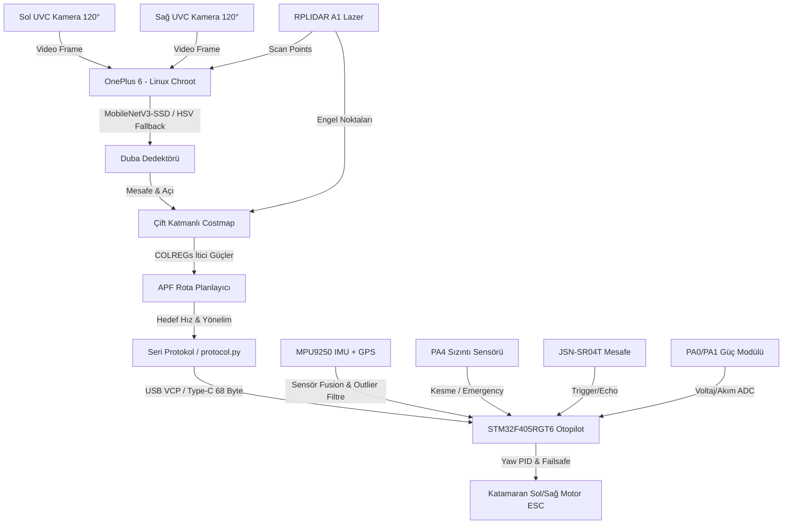
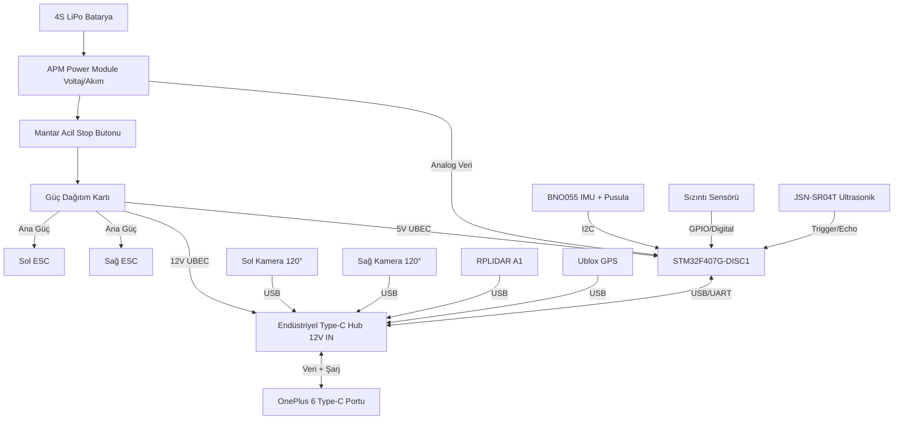

# Beebot - İnsansız Deniz Aracı (İDA) Otonom Kontrol ve Seyrüsefer Sistemi

[English Version / İngilizce Sürüm](README.md)

Bu proje, **TEKNOFEST 2026 İnsansız Deniz Aracı Şartnamesi** standartlarına tam uyumlu olarak geliştirilmiş; **OnePlus 6 (Yüksek Seviye Otonomi)** ve **STM32F405RGT6 (Alçak Seviye Otopilot)** donanımları üzerinde koşan, çift UVC geniş açılı kamera (240° görüş), RPLIDAR A1 lazer tarayıcı (360° engel algılama), donanımsal su sızıntı koruması, ön mesafe ultrasonik sensörü ve güç modülü akım takibi gibi gelişmiş donanımlara sahip, komple bir otonom seyrüsefer kontrol yazılımıdır.

---

## 🛠️ Teknoloji Yığını (Tech Stack)

Sistem, kaynak yönetimi, işlem hızı ve donanımsal güvenlik gereksinimlerini karşılamak amacıyla katmanlı bir teknoloji yığınıyla inşa edilmiştir:

### 1. Yüksek Seviye Otonomi Katmanı (OnePlus 6 / Linux Chroot)
* **Algılayıcı Donanımlar:**
  * **Çift UVC Geniş Açılı Kamera:** Açısal sapma düzeltmeli (-60° ve +60°) toplam 240 derecelik ön görüş alanı.
  * **RPLIDAR A1 2D Lazer Tarayıcı:** 12 metre menzilli 360 derece lazer mesafe taraması ve costmap entegrasyonu.
* **İşletim Sistemi / Çalışma Ortamı:**
  * **Ubuntu Base 22.04 LTS (ARM64):** Termux üzerinde çalışan minimal, yüksek performanslı Linux kök dosya sistemi (Chroot).
  * **Termux & Termux:Boot:** Güç verildiği an yazılımı başlatan otomatik önyükleme (autoboot) altyapısı.
  * **Android System Tweaks:** ADB WM (`window manager`) ve ekran yoğunluğu (`density`) optimizasyonları, Magisk arka plan servis koruması.
* **Programlama Dili:** Python 3.10
* **Kütüphaneler ve Altyapı:**
  * **OpenCV DNN (Headless):** Kamera akışı alma, video loglama ve derin öğrenme modellerinin GPU (Adreno 630 OpenCL) üzerinde koşturulması.
  * **NumPy:** Hızlı matris işlemleri, ızgara haritası (costmap) güncellemeleri ve potansiyel alan vektör hesaplamaları.
  * **PySerial:** Otomatik kurtarma (auto-reconnect) özellikli, asenkron ve düşük gecikmeli seri haberleşme.
  * **MobileNetV3-SSD (ONNX/OpenCV DNN):** CPU/GPU (OpenCL) üzerinde aşırı ısınmayı (thermal throttling) önlemek için optimize edilmiş duba algılama modeli.

### 2. Alçak Seviye Kontrol Katmanı (STM32F405RGT6 / Bare-Metal)
* **İşletim Sistemi:** FreeRTOS (Çoklu görev yönetimi ve deterministik çalışma için).
* **Programlama Dili:** Bare-Metal C (C99 Standardı)
* **Donanım Hızlandırma, Sensörler ve Optimizasyonlar:**
  * **Su Sızıntı Sensörü:** PA4 pini üzerinden daldırma tipi su sızıntı algılaması ve donanımsal kilitlemeli motor kapatma.
  * **JSN-SR04T Su Geçirmez Ultrasonik Sensör:** PA5 (Trigger) ve PB0 (Echo) pinleri üzerinden 4.5 metre menzilli ön mesafe ölçümü.
  * **Güç Modülü (Akım & Voltaj):** PA0 (Akım) ve PA1 (Voltaj) üzerinden ADC ile pil sağlığı ve yük takibi.
  * **STM32 FPU (Floating Point Unit):** SCB CPACR registerları üzerinden donanımsal float PID hesaplama.
  * **ART Accelerator (Flash Cache/Prefetch):** 168 MHz SYSCLK hızında Flash bellek gecikmelerini sıfırlayan önbellek mekanizması.
  * **DMA (Direct Memory Access):** İşlemciyi meşgul etmeden seri port verilerini RAM dairesel tamponuna yazan USART DMA (NDTR register takipli).
  * **CRC16-ANSI:** İletişim paketlerinin veri bütünlüğünü doğrulayan sağlama algoritması.

### 3. Simülasyon ve Test Altyapısı
* **SITL (Software-in-the-Loop) Simulator:** Katamaran itki fiziğini, su sürüklenmesini, akıntı/rüzgar kuvvetlerini ve sanal kamera görüş alanını (FOV) simüle eden 2D OpenCV/Python test ortamı.

---

## 🛠️ Sistem Mimarisi ve Veri Akışı



---

## 🔌 Donanım Bağlantı Şeması



---

## 📊 En Ufak Görev Dağılımı ve Görev Dağılım Matrisi

Projedeki yazılımsal ve donanımsal işlevlerin, kod dosyaları, sınıf/fonksiyon seviyesinde en küçük görev dağılımı aşağıdaki tabloda verilmiştir:

| Modül / Özellik | Alt Görev | Sorumlu Dosya / Sınıf | Çalışma Seviyesi | Açıklama |
| :--- | :--- | :--- | :--- | :--- |
| **Algılama (Perception)** | Yapay Cihaz Model Çıkarımı | [detector.py](file:///c:/Users/Şahakan/Desktop/aydede/high_level/src/detector.py) -> `BuoyDetector.detect()` | Yüksek Seviye (Python) | MobileNetV3-SSD modelini çalıştırarak dubaların bounding box bilgilerini çıkarır. |
| | Çoklu Kamera Yönetimi | [main.py](file:///c:/Users/Şahakan/Desktop/aydede/high_level/src/main.py) -> `VideoGrabber` | Yüksek Seviye (Python) | Birden fazla kamerayı okur ve açı offsetleri uygulayarak duba yönelimlerini düzeltir. |
| | LIDAR Veri Toplama | [main.py](file:///c:/Users/Şahakan/Desktop/aydede/high_level/src/main.py) -> `LidarWorker` | Yüksek Seviye (Python) | RPLIDAR A1 verilerini asenkron okur ve costmap katmanına engel olarak yazar. |
| | HSV Renk Bölütleme | [detector.py](file:///c:/Users/Şahakan/Desktop/aydede/high_level/src/detector.py) -> `BuoyDetector.hsv_fallback()` | Yüksek Seviye (Python) | Derin öğrenme başarısız olduğunda veya karanlıkta yedek HSV filtresiyle duba tespiti yapar. |
| | Lens Tıkanıklık Tespiti | [detector.py](file:///c:/Users/Şahakan/Desktop/aydede/high_level/src/detector.py) -> `BuoyDetector.check_lens_obstruction()` | Yüksek Seviye (Python) | Kameraya su sıçraması, çamur veya mercek kapanmasını kontrast analiziyle saptar. |
| | Zamansal Doğrulama | [detector.py](file:///c:/Users/Şahakan/Desktop/aydede/high_level/src/detector.py) -> `TemporalFilter` | Yüksek Seviye (Python) | Dalgalardan dolayı dubaların anlık kaybolup görünmesindeki gürültüleri filtreler. |
| **Haritalama (Mapping)** | Costmap Izgara Güncelleme | [costmap.py](file:///c:/Users/Şahakan/Desktop/aydede/high_level/src/costmap.py) -> `LocalCostmap.update()` | Yüksek Seviye (Python) | Kamera ve LIDAR tespitlerini İDA merkezli 2D egocentric doluluk haritasına (Occupancy Grid) işler. |
| | Kapı Kuvvetleri (Symmetric) | [costmap.py](file:///c:/Users/Şahakan/Desktop/aydede/high_level/src/costmap.py) -> `LocalCostmap.get_gate_forces()` | Yüksek Seviye (Python) | Çift turuncu duba kapılarından geçerken İDA'nın tam ortadan hizalanmasını sağlar. |
| | Engel İtme (COLREGs) | [costmap.py](file:///c:/Users/Şahakan/Desktop/aydede/high_level/src/costmap.py) -> `LocalCostmap.get_obstacle_forces()` | Yüksek Seviye (Python) | Sarı engellerden gelen itme kuvvetini 22° sancağa kırarak deniz trafik kurallarına uyum sağlar. |
| **Seyrüsefer (Navigation)** | Rota Planlama (APF / IvP-Lite) | [planner.py](file:///c:/Users/Şahakan/Desktop/aydede/high_level/src/planner.py) -> `APFPlanner.plan()` | Yüksek Seviye (Python) | Eylem uzayı puanlamasıyla (IvP-Lite) engellerden kaçarken yerel minimum problemine takılmadan seyreder. |
| | Düzlem Geçiş Kontrolü | [planner.py](file:///c:/Users/Şahakan/Desktop/aydede/high_level/src/planner.py) -> `APFPlanner.plan()` (Along-Track) | Yüksek Seviye (Python) | Kapı çizgisi tam geçilmeden bir sonraki yol noktasına dönülmesini (erken dönüş) engeller. |
| | Enine Sapma Entegrali | [planner.py](file:///c:/Users/Şahakan/Desktop/aydede/high_level/src/planner.py) -> `self.cte_integrator` | Yüksek Seviye (Python) | Akıntı veya sert rüzgar sürüklemesini saptayıp zıt yönde dümen açısı hesaplar. |
| | Dönüş Hızı Koruması | [planner.py](file:///c:/Users/Şahakan/Desktop/aydede/high_level/src/planner.py) -> `angle_factor` | Yüksek Seviye (Python) | Keskin U dönüşlerinde katamaranın devrilmesini önlemek için hızı otomatik sınırlar. |
| **Görev Kontrol (FSM)** | Durum Makinesi | [mission_control.py](file:///c:/Users/Şahakan/Desktop/aydede/high_level/src/mission_control.py) -> `MissionController` | Yüksek Seviye (Python) | Nokta Takip, Engel Kaçınma, Kamikaze ve Failsafe durum geçişlerini koordine eder. |
| | Öngörülü Sanal Çit | [mission_control.py](file:///c:/Users/Şahakan/Desktop/aydede/high_level/src/mission_control.py) -> `Geofence` | Yüksek Seviye (Python) | İDA'nın mevcut hızıyla 2 saniye sonra 100m sınırını aşıp aşmayacağını kestirerek motorları kapatır. |
| | Failsafe Tetikleyicileri | [mission_control.py](file:///c:/Users/Şahakan/Desktop/aydede/high_level/src/mission_control.py) -> `Failsafe` | Yüksek Seviye (Python) | Düşük pil, GPS kaybı, telemetri kopması veya kamera tıkanmasında acil durum modunu tetikler. |
| **Sistem / Altyapı** | CPU Çekirdek Ataması | [main.py](file:///c:/Users/Şahakan/Desktop/aydede/high_level/src/main.py) | Yüksek Seviye (Python) | Seyrüsefer işlemlerini Snapdragon'un büyük Kryo Gold çekirdeklerine (affinity 4-7) kilitler. |
| | Otomatik Reconnect | [main.py](file:///c:/Users/Şahakan/Desktop/aydede/high_level/src/main.py) -> `Serial client loop` | Yüksek Seviye (Python) | Fiziksel USB temassızlıklarında seri bağlantıyı 1ms içinde otomatik olarak ayağa kaldırır. |
| | Çöp Toplayıcı (GC) Ayarı | [main.py](file:///c:/Users/Şahakan/Desktop/aydede/high_level/src/main.py) -> `gc.collect()` | Yüksek Seviye (Python) | Python'ın zamansız çöp toplama duraklamalarını (stop-the-world) engellemek için GC'yi manuel yönetir. |
| | GCS Kablosuz Acil Stop | [main.py](file:///c:/Users/Şahakan/Desktop/aydede/high_level/src/main.py) -> `GCSListener` | Yüksek Seviye (Python) | UDP port 12345 veya telsiz üzerinden gelen kablosuz ASCII komutları ayrıştırarak failsafe'e alır. |
| **Donanım / Haberleşme** | 68-Bayt Seri Protokol | [protocol.py](file:///c:/Users/Şahakan/Desktop/aydede/high_level/src/protocol.py) & [protocol.h](file:///c:/Users/Şahakan/Desktop/aydede/low_level/include/protocol.h) | Çift Katmanlı (C/Py) | CRC16 ANSI doğrulamalı paketleme ve telemetri ayrıştırma işlemlerini yürütür. |
| | DMA Dairesel Tampon | [main.c](file:///c:/Users/Şahakan/Desktop/aydede/low_level/src/main.c) -> `DMA2_Stream5` | Alçak Seviye (C) | UART DMA NDTR sayacıyla sıfır CPU yüküyle gelen seri verileri RAM dairesel arabelleğine yazar. |
| **Alçak Seviye Kontrol** | Su Sızıntı Koruması | [safety.c](file:///c:/Users/Şahakan/Desktop/aydede/low_level/src/safety.c) -> `safety_update()` | Alçak Seviye (C) | PA4 pini üzerinden daldırma tipi su sızıntı sensörünü denetler, LOW algılandığında sistemi kilitler. |
| | Ön Ultrasonik Mesafe | [sensors.c](file:///c:/Users/Şahakan/Desktop/aydede/low_level/src/sensors.c) -> `sensors_read_ultrasonic()` | Alçak Seviye (C) | JSN-SR04T sensörü için 10us trigger pulse üretip echo yansıma süresini metreye dönüştürür. |
| | Voltaj & Akım ADC | [sensors.c](file:///c:/Users/Şahakan/Desktop/aydede/low_level/src/sensors.c) -> `sensors_current_read()` | Alçak Seviye (C) | ADC_CHANNEL_1 ve ADC_CHANNEL_0 kanallarını dinamik olarak yeniden yapılandırarak voltaj ve akım okur. |
| | Yaw PID Hesaplama | [control.c](file:///c:/Users/Şahakan/Desktop/aydede/low_level/src/control.c) -> `PID_Update()` | Alçak Seviye (C) | Açı taşması (-180° / +180° sarmalaması) korumalı dümen açısı ve rota sabitleme PID hesabı. |
| | İtki Eşleme | [control.c](file:///c:/Users/Şahakan/Desktop/aydede/low_level/src/control.c) -> `Control_UpdateMotors()` | Alçak Seviye (C) | Planlanan hız ve yönelim komutlarını katamaranın Sol ve Sağ ESC/Fırçasız motor PWM sinyallerine böler. |
| | Donanımsal Watchdog | [safety.c](file:///c:/Users/Şahakan/Desktop/aydede/low_level/src/safety.c) -> `Safety_Check()` | Alçak Seviye (C) | Sinyal kaybı, RC kumanda kopması veya telefon çökmesi durumunda motorları kilitleyen emniyet halkası. |

---

## 📂 Dosya Yapısı ve Kod Linkleri

* **[high_level/src/](file:///c:/Users/Şahakan/Desktop/aydede/high_level/src)** - Üst Seviye Karar Katmanı (Python)
  * [main.py](file:///c:/Users/Şahakan/Desktop/aydede/high_level/src/main.py) - Giriş noktası. Thread yönetimi, USB reconnect, CPU Affinity, çoklu kamera okuyucu ve LIDAR işçisi.
  * [protocol.py](file:///c:/Users/Şahakan/Desktop/aydede/high_level/src/protocol.py) - STM32 ile 68 baytlık telemetri ve 17 baytlık komut paketlerini CRC16 ile eşleyen binary haberleşme modülü.
  * [telemetry_logger.py](file:///c:/Users/Şahakan/Desktop/aydede/high_level/src/telemetry_logger.py) - Bellek sızıntısı korumalı (OOM önleme kuyruklu) asenkron video, CSV ve JSON costmap loglayıcı.
  * [detector.py](file:///c:/Users/Şahakan/Desktop/aydede/high_level/src/detector.py) - ONNX MobileNetV3-SSD duba dedektörü, HSV renk bölütleme yedek filtresi ve mercek tıkanıklık koruması.
  * [costmap.py](file:///c:/Users/Şahakan/Desktop/aydede/high_level/src/costmap.py) - Yerel Occupancy Grid. Kamera ve LIDAR verilerinden engel haritası şişirme ve COLREGs sağa kaçış itimi üretimi.
  * [planner.py](file:///c:/Users/Şahakan/Desktop/aydede/high_level/src/planner.py) - IvP-Lite eylem uzayı planlayıcı. Akıntı sürüklenmesine karşı CTE integral terimi ve kapılardan tam geçiş için Along-Track Plane Crossing mantığı.
  * [mission_control.py](file:///c:/Users/Şahakan/Desktop/aydede/high_level/src/mission_control.py) - Sonlu Durum Makinesi (FSM). 100m Öngörülü Sanal Çit koruması, GPS kaybı Dead Reckoning moduna geçişi ve Failsafe kararları.

* **[low_level/](file:///c:/Users/Şahakan/Desktop/aydede/low_level)** - STM32F405RGT6 Otopilot Kodları (Bare-Metal C)
  * [main.c](file:///c:/Users/Şahakan/Desktop/aydede/low_level/src/main.c) - FreeRTOS görev yapılandırmaları, USART DMA dairesel tampon okuyucusu ve ADC/GPIO kurulumları.
  * [control.c](file:///c:/Users/Şahakan/Desktop/aydede/low_level/src/control.c) - Açı sarmalamalı PID yaw kontrolü ve katamaran motor itki diferansiyel eşleyicisi.
  * [safety.c](file:///c:/Users/Şahakan/Desktop/aydede/low_level/src/safety.c) - Donanımsal arıza kilidi (latch), watchdogs, sızıntı koruması, acil stop kesmeleri.
  * [sensors.c](file:///c:/Users/Şahakan/Desktop/aydede/low_level/src/sensors.c) - GPS parser, I2C kilitlenme kurtarma (9 clock darbesi), tamamlayıcı yön filtresi, ultrasonik sensör ve dinamik ADC akım okuma.

* **[scratch/](file:///c:/Users/Şahakan/Desktop/aydede/scratch)** - Test ve Doğrulama
  * [sitl_simulator.py](file:///c:/Users/Şahakan/Desktop/aydede/scratch/sitl_simulator.py) - Katamaran fiziği, akıntı sürüklemesi, sanal lidar/kamera görüşü içeren 2D görsel simülatör.
  * [test_gate_navigation.py](file:///c:/Users/Şahakan/Desktop/aydede/scratch/test_gate_navigation.py) - Along-track kapı geçiş mantığının dikey eksende doğruluğunu ölçen headless test betiği.
  * [test_stm32_compatibility.py](file:///c:/Users/Şahakan/Desktop/aydede/scratch/test_stm32_compatibility.py) - 68 baytlık telemetri yapısının yapısal hizalamasını test eden script.

---

## 🌊 Otonom Sistemin Suda Karşılaştığı 10 Kötü Senaryo Koruması

İDA'nın fiziksel testlerde batmasını veya kontrolden kaçmasını önlemek üzere tasarlanan 10 kritik koruma mekanizması:
1. **GPS Konum Sıçraması (Jitter):** Dinamik dt tabanlı outlier süzgeciyle 6.0 m/s'den hızlı yapay yer değişimleri elenir.
2. **Pusula Manyetik Bozulması:** Metal gövde veya manyetik alan nedeniyle pusula saptığında, tekne hareket halindeyken GPS COG (Course Over Ground) verisi referans yön olarak pusulayı düzeltir.
3. **I2C Hattı Kilitlenmesi (Sensor Crash):** MPU9250 okumalarında kilitlenme yaşanırsa, SCL pinine donanımsal 9 clock darbesi gönderilerek hat otomatik resetlenir.
4. **Rüzgar/Akıntı Sürüklemesi:** Rota çizgisinden sürüklenmeler planlayıcı içindeki Enine Sapma Entegrali (CTE) ile saptanarak akıntıya karşı dirençli yön komutu üretilir.
5. **Kamera Merceği Kapanması:** Görüntü analiziyle kontrast ve parlaklık sürekli izlenerek kameranın tıkanması saptanır ve güvenli moda (`FAILSAFE`) geçilir.
6. **Dalgalardan Anlık Duba Kayıpları:** Dubaların 5 ardışık kareden en az 3'ünde görülme şartı (Temporal Filter) ile dalgaların duba kapatma gürültüleri elenir.
7. **Haberleşme Kablosu Çıkması / Donma:** 500 ms boyunca telefondan veri paketi gelmezse STM32 otopilotu motor güçlerini anında keser.
8. **Anlık Pil Voltaj Çökmesi (Sag):** Motorların ani tork çekmesiyle pilde yaşanan dalgalanmalar EMA filtresiyle süzülür, kesintisiz 3s düşük voltaj olmadıkça motorlar kapatılmaz.
9. **Yosun Dolanması/Pervane Sıkışması:** Yüksek dönüş veya hız komutuna rağmen teknenin dönemediği (yaw_rate < 2.0 deg/s) saptanırsa motor korumak için sistem kilitlenir.
10. **Teknenin Kaçıp Gitmesi (Flyaway):** Kalkış noktasından 100 metrelik Geofence sınırı aşılmadan 2 sn önce İDA'nın mevcut hızıyla frenleme mesafesi hesaplanır ve acil stop tetiklenir.

---

## 🚀 SITL Simülatörünü Çalıştırma

Geliştirilen tüm algoritmaları göle veya denize inmeden önce test etmek için 2D fizik simülatörünü çalıştırabilirsiniz.

```bash
python scratch/sitl_simulator.py
```

---

## 📦 Çevrimdışı Linux Chroot Kurulumu (`phone_assets`)

İDA otonomi sisteminin telefonda çalışması için gereken tüm sistem bağımlılıkları ve **Ubuntu Base 22.04 ARM64** imajı tek bir klasörde (`phone_assets/`) bir araya getirilmiştir. 

### Çevrimdışı Kurulum Adımları:
1. Tüm `beebot` klasörünü telefonun Termux ev dizinine kopyalayın (`/data/data/com.termux/files/home/beebot`).
2. Termux'ta root yetkisi alarak kurulum betiğini çalıştırın:
   ```bash
   su
   sh /data/data/com.termux/files/home/beebot/phone_assets/setup_chroot.sh
   ```

---

## 🛡️ STM32 Sağlık ve Emniyet Yönetimi

İDA'nın fiziksel emniyeti ve sistem bütünlüğü, STM32 otopilotu üzerinde çalışan katmanlı donanım/yazılım korumalarıyla güvenceye alınmıştır:

1. **Çoklu Görev Watchdog Sistemi:**
   * Bağımsız watchdog (IWDG) donanımı aktif edilmiştir.
   * `StartTelemetryTask`, `StartNavigationTask` ve `StartSafetyTask` döngüleri, kendi çalışma periyotlarında otopilotu besler. Herhangi bir görev kilitlenirse IWDG yenilenmez ve STM32 2.0 saniye içinde donanımsal olarak kendini resetler.
2. **Fiziksel Acil Stop (EXTI Button):**
   * PC13 pinine bağlı mantar buton tetiklendiği an donanımsal dış kesme (`EXTI15_10_IRQHandler`) çalışır, motor PWM çıkışları (PA6, PA7) anında `1500us` (nötr/stop) seviyesine çekilerek otopilot `MODE_EMERGENCY` modunda kilitlenir.
3. **Zaman Aşımı Korumaları:**
   * **Telemetri Kaybı:** Telefon ile STM32 arasındaki bağlantı koptuğunda veya 500ms'den uzun süre telefon komutu alınmadığında STM32 motorları kapatır.
   * **RC Kumanda Bağlantı Kopması:** RC alıcısından gelen sinyal kalitesi düştüğünde sistem otomatik olarak failsafe durumuna geçer.

---

## 🗺️ Versiyonlama ve Protokol Yol Haritası

* **Sürüm Kontrolü:** Tüm paket başlıklarında Sync baytlarından hemen sonra 1 baytlık `PROTOCOL_VERSION = 0x01` doğrulaması yapılır.
* **Geliştirme Yol Haritası:**
  * `v1.0.0` (Mevcut): Çift kamera entegrasyonu (240°), RPLIDAR A1 engel haritası, 68 baytlık seri telemetri protokolü, sızıntı sensörü failsafe'i ve GCS acil durdurma desteği.
  * `v1.1.0` (Planlanan): Çoklu İDA sürü koordinasyonu için MAVLink mesaj çevirici köprüsü (`mavlink_bridge.py`).

---

## 💾 STM32 Firmware Güncelleme ve Kurtarma (DFU Guide)

### Yöntem A: STM32CubeProgrammer ile USB DFU Üzerinden Güncelleme (Önerilen)
1. Botun elektriğini kapatın.
2. STM32 kartı üzerindeki `BOOT0` pinini `3.3V` pinine kısa devre yapın.
3. Kartı micro-USB kablosuyla bilgisayara bağlayın.
4. **STM32CubeProgrammer** yazılımını açın. Sağ üstteki bağlantı türünü **USB** seçip **Connect** butonuna basın.
5. `STM32/build/beebot.bin` (veya kurtarma dosyası `rollback.bin`) dosyasını seçin.
6. Click **Start Programming** (veya programlamayı başlat) butonuna basarak yükleme işlemini tamamlayın.
7. Yükleme bittiğinde `BOOT0` pinini `GND` konumuna çekip kartı yeniden başlatın.

---

## 🚀 Son Güncellemeler ve İyileştirmeler (Mayıs 2026)

Projede en son gerçekleştirilen kritik düzeltmeler ve mimari iyileştirmeler şunlardır:

1. **YOLOv8 -> MobileNetV3-SSD Geçişi:**
   * OnePlus 6'nın Snapdragon 845 işlemcisinde oluşabilecek aşırı ısınmayı ve termal yavaşlamayı (thermal throttling) önlemek için YOLOv8 modeli yerine OpenCV DNN altyapısı ile çalışan **MobileNetV3-SSD** modeline geçildi.
   * GPU (OpenCL) ve CPU üzerinde son derece kararlı çalışan bu model, duba algılama performansından ödün vermeden işlemci sıcaklığını güvenli sınırlarda tutmaktadır.
   * Düşük ışık, aşırı parlama ve dalgalı deniz koşulları için dinamik **HSV Filtreleme ve Kontur Analizi** algoritmaları yedek perceptron katmanı olarak sisteme entegre edildi.

2. **STM32 DMA NDTR Dairesel Tampon Kilitlenme Düzeltmesi:**
   * Telefon ile STM32 arasındaki 68 baytlık dairesel USART DMA veri transferinde yaşanan kilitlenme (infinite loop) riski çözüldü.
   * `main.c` dosyasındaki DMA okuma işaretçisi (`dma_write_ptr`) hesaplanırken `USART1_RX_BUF_SIZE` boyutuna göre modulo (`%`) koruması getirilerek arabellek sınır taşması engellendi.

3. **`beebot_kontrol.py` Tek Tuşla Yönetim Sihirbazı:**
   * Yarış günü donanım ve yazılımların hızlı kontrolü için terminal karmaşasını bitiren bir yönetim sihirbazı geliştirildi. Bu panel üzerinden tek tıkla eksik kütüphaneler kurulabilir, port yetkileri (`chmod 666`) ayarlanabilir ve dry-run testleri başlatılabilir.

4. **Fütüristik Katamaran Gövdesi ve Modüler Batarya Kızak Tasarımı (CAD/SolidWorks):**
   * Teknofest 2026 şartnamesine tam uyumlu, $120 \times 80 \times 40\text{ cm}$ boyutlarında fütüristik dalga delici (wave-piercing) katamaran gövdesi ve modüler kızaklı batarya tepsisi tasarımları yapıldı.
   * Türkçe ve İngilizce SolidWorks kurulumlarında plane, sketch ve extrüzyon yönü uyuşmazlıkları nedeniyle yaşanan tüm VBA çalışma zamanı hataları (özellikle **Runtime Error 91**) giderildi. Unicode korumalı `SelectPlane` ve dinamik `RenameLastFeature` algoritmalarıyla %100 dil-bağımsız çalışan VBA makroları [catamaran_solidworks_macro.md](file:///c:/Users/Şahakan/Desktop/aydede/catamaran_solidworks_macro.md) dosyasına eklendi.

