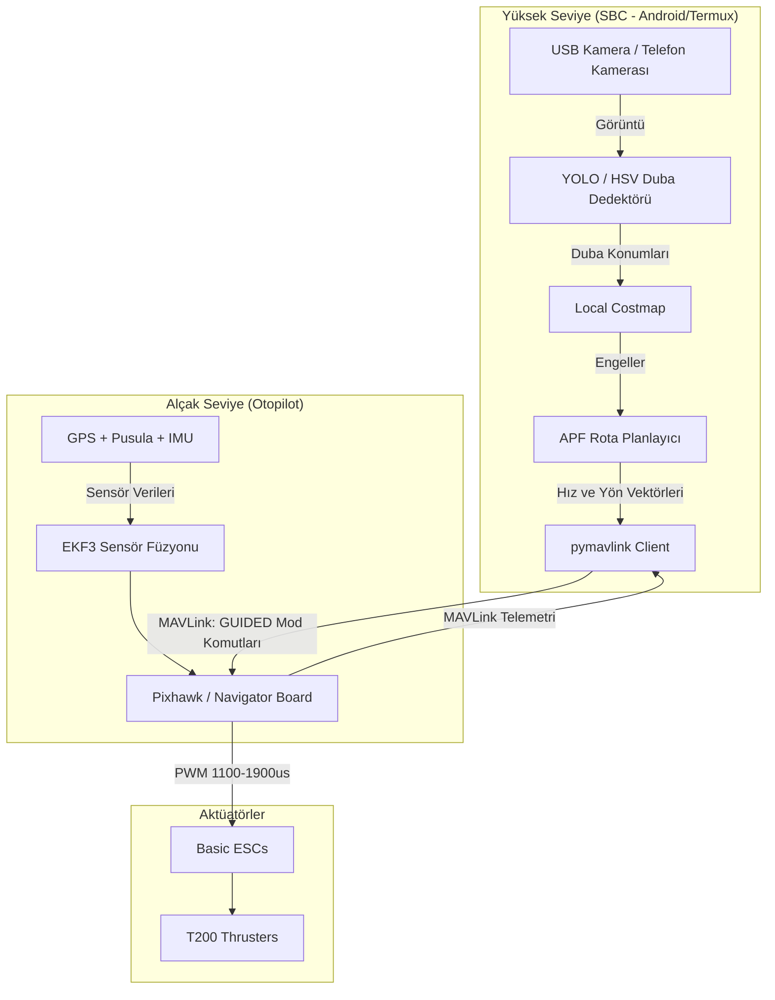

# İDA Projesinde Blue Robotics ve ArduPilot/MAVLink Ekosistemi Analiz Raporu

Bu rapor, İDA (İnsansız Deniz Aracı) projesinde kullanılan mevcut özel (custom) STM32 ve Python otonomi mimarisinin, endüstri standardı olan **Blue Robotics**, **ArduPilot (ArduRover/ArduBoat)** ve **MAVLink** ekosistemine entegrasyon imkanlarını, fizibilitesini, avantajlarını ve olası risklerini incelemektedir.

---

## 1. Blue Robotics ve İlgili Teknolojilerin Tanımı

Blue Robotics, denizcilik ve su altı/üstü robotik sistemler için küresel çapta en popüler donanım ve yazılım altyapısı sağlayıcısıdır. Ekosistem şu bileşenlerden oluşur:

1.  **Donanım Altyapısı:**
    *   **İticiler (Thrusters):** Sektör standardı olan fırçasız su altı motorları (T200 ve T500).
    *   **ESC (Hız Kontrol Kartları):** Basic ESC serisi, su sızdırmaz motor sürücüler.
    *   **Sensörler:** Bar30/Bar100 derinlik/basınç sensörleri, Ping Echosounder (sonar), su altı kameraları.
    *   **Navigator Uçuş Kontrolcüsü:** Raspberry Pi üzerine takılan, üzerinde IMU, pusula, ADC ve PWM çıkışları barındıran otopilot kartı.
2.  **Yazılım Altyapısı:**
    *   **ArduPilot / ArduSub / ArduRover:** Açık kaynaklı, endüstriyel kalitede otopilot yazılımları.
        *   *Önemli Ayrım:* Su altı araçları (ROV) için **ArduSub**, su üstü otonom botlar (İDA/USV) ve kara araçları için **ArduRover** (ArduBoat) firmware'i kullanılır.
    *   **BlueOS:** Raspberry Pi gibi tek kart bilgisayarlarda (SBC) çalışan, video yayınlarını yöneten, MAVLink paketlerini yönlendiren ve Docker konteynerleri ile genişletilebilen yeni nesil işletim sistemi/arayüz.
    *   **MAVLink Protokolü:** Otopilot ile yüksek seviyeli bilgisayar (SBC) veya Yer Kontrol İstasyonu (QGroundControl) arasında haberleşmeyi sağlayan, son derece hafif ve güvenilir ikili (binary) bir iletişim protokolü.

---

## 2. Bizim Sistemimizde Kullanılabilir mi? (Fizibilite)

Mevcut yazılım sistemimiz, yüksek seviyeli kararları veren bir **Android SBC (Termux üzerinde Python)** ile motorları süren ve temel sensörleri (IMU, GPS) okuyan bir **STM32 mikrodenetleyicisi** üzerine kuruludur. Blue Robotics ekosisteminin sistemimizle uyumluluğu şu şekildedir:

### A. Donanım Seviyesinde Uyumluluk: **%100**
*   **Motorlar ve ESC'ler:** Blue Robotics T200/T500 motorları ve Basic ESC'leri, standart RC sinyalleri (50Hz frekansta 1100µs - 1900µs PWM darbe genişliği, 1500µs nötr) ile çalışır. Mevcut STM32 firmware'imizdeki `TIM3` PWM çıkışları bu motorları hiçbir donanımsal veya yazılımsal değişiklik gerektirmeden **doğrudan sürebilir**.
*   **Sensörler:** I2C veya seri port üzerinden çalışan Blue Robotics sensörleri (örneğin Bar30 basınç sensörü veya Ping Sonar), STM32 veya doğrudan Python bilgisayarı üzerinden okunabilir.

### B. Yazılım Seviyesinde Uyumluluk: **%100 (Mimari Dönüşüm ile)**
*   Eğer otopilot olarak **ArduPilot (ArduRover)** yazılımına geçilirse, mevcut Python otonomi algoritmalarımız (APF planlayıcı, YOLO duba tespiti vb.) korunabilir.
*   Python kodumuzdaki `protocol.py` (seri haberleşme katmanı) devre dışı bırakılır ve yerine MAVLink kütüphanesi (`pymavlink`) entegre edilir. Böylece Python, STM32 ile konuşmak yerine standart otopilot kartı (Pixhawk/Navigator) ile MAVLink üzerinden konuşur.

> [!NOTE]
> **Kritik Android/Termux Detayı:**
> Mevcut sistemimizde companion computer (SBC) olarak bir **Android Telefon (Termux)** kullanılmaktadır. 
> *   Blue Robotics'in **BlueOS** işletim sistemi doğrudan Raspberry Pi/Debian mimarisi ve Docker konteynerleri için tasarlanmıştır. Bu nedenle BlueOS'u Android telefonda çalıştırmak oldukça zordur.
> *   **Ancak buna gerek yoktur.** Android telefonumuz, USB OTG kablosu üzerinden bir Pixhawk otopilot kartına bağlanabilir. Python otonomi kodumuz, Termux altında `pymavlink` kütüphanesini kullanarak Pixhawk ile seri port (`/dev/ttyACM0` veya `/dev/ttyUSB0`) üzerinden doğrudan ve kararlı bir şekilde haberleşebilir.

---

## 3. Nasıl Entegre Edilebilir? (Entegrasyon Senaryoları)

Projede uygulayabileceğimiz 3 farklı entegrasyon senaryosu bulunmaktadır:

### Senaryo A: Tam Otopilot Geçişi (Pixhawk + ArduRover + Python Otonomi)
*Bu senaryo, uzun vadeli kararlılık ve endüstriyel standartlar için en çok önerilen yaklaşımdır.*

*   **Nasıl Yapılır?**
    1.  Mevcut custom STM32 kartı sistemden çıkarılır. Yerine standart bir uçuş kontrolcüsü (**Pixhawk 4/6C, Cube Orange veya Navigator**) yerleştirilir.
    2.  Otopilot kartına **ArduRover (ArduBoat)** firmware'i yüklenir. Motor miksajı (Skid-Steer / diferansiyel sürüş) ve temel kalibrasyonlar (pusula, ivmeölçer, GPS) Mission Planner veya QGroundControl yazılımları ile yapılır.
    3.  Tüm fiziksel sensörler (GPS, pusula, IMU) doğrudan otopilot kartına bağlanır.
    4.  Android telefon (Termux) USB OTG üzerinden Pixhawk'a bağlanır.
    5.  Python tarafında `protocol.py` kaldırılarak `pymavlink` entegrasyonu yapılır. APF planlayıcımızın ürettiği kaçınma vektörleri (hız ve yaw açısı), Pixhawk'a `GUIDED` modunda MAVLink komutlarıyla gönderilir.
*   **Avantajları:**
    *   STM32 C kodundaki FreeRTOS race condition, UART overrun veya I2C bus kilitlenmesi gibi tüm alçak seviyeli kararsızlıklar **tamamen ortadan kalkar**.
    *   ArduPilot'ın milyonlarca saat test edilmiş EKF3 (Genişletilmiş Kalman Filtresi) algoritması sayesinde, botun yönelimi (Yaw/Pusula) ve konumu (GPS) kusursuz bir şekilde birleştirilir. Mevcut custom sistemimizdeki "hızlı dönüşlerde costmap kayması" (Ego-Motion) problemi otomatik olarak çözülür.
    *   Donanımsal güvenlik önlemleri (Geofence, pil düşük alarmı, iletişim kaybı durumunda otomatik eve dönme - RTL) ArduPilot tarafından donanımsal düzeyde yönetilir.

### Senaryo B: Hibrit Entegrasyon (Sadece İletişim Köprüsü)
*Mevcut STM32 kartını koruyup haberleşmeyi standartlaştırmak isteyen ara çözümdür.*

*   **Nasıl Yapılır?**
    1.  STM32 kartımız ve üzerindeki FreeRTOS yazılımı korunur.
    2.  STM32 C kodundaki özel ikili protokol (`protocol.h`) ve Python tarafındaki `protocol.py` silinir.
    3.  Hem STM32 C koduna hem de Python koduna MAVLink kütüphanesi entegre edilir. İki cihaz kendi aralarında MAVLink paketleri (örneğin `HEARTBEAT`, `ATTITUDE`, `GPS_RAW_INT`, `RC_CHANNELS_OVERRIDE`) kullanarak haberleşir.
*   **Neden Önerilmez?**
    *   Çok yüksek geliştirme eforu gerektirir.
    *   STM32 tarafındaki FreeRTOS kararsızlıklarını ve donanımsal I2C kilitlenme risklerini çözmez.
    *   ArduPilot'ın gelişmiş stabilizasyon, EKF3 sensör füzyonu ve hazır failsafe özelliklerinden yararlanılamaz.

### Senaryo C: Sadece Donanım Entegrasyonu (Yazılıma Dokunmadan)
*Yazılımı tamamen aynı tutup sadece fiziksel güç ve motor altyapısını güçlendirmek için kullanılır.*

*   **Nasıl Yapılır?**
    1.  Yazılım mimarisi (Python otonomi + STM32 FreeRTOS firmware) olduğu gibi bırakılır.
    2.  Teknenin arkasına iki adet **Blue Robotics T200 fırçasız motor** ve **Basic ESC** takılır.
    3.  ESC'lerin sinyal kabloları STM32'nin `TIM3_CH1` ve `TIM3_CH2` pinlerine bağlanır.
    4.  Mevcut STM32 PWM kodumuz (1500 nötr, 1100-1900 limitleri) motorları doğrudan sürer.
*   **Avantajları:** Sıfır yazılım eforu, hızlı fiziksel test imkanı.
*   **Dezavantajları:** Alçak seviyeli yazılım hataları (STM32 çökme riskleri, sensör gürültüleri) devam eder.

---

## 4. Olası Sorunlar ve Riskler (Sorun Çıkarır mı?)

Sistemi Blue Robotics / ArduPilot ekosistemine taşırken karşılaşabileceğimiz olası problemler şunlardır:

### 1. Yazılımsal Yeniden Yazım Eforu (High-Level Porting)
*   **Sorun:** `protocol.py` dosyasını tamamen çöpe atmak ve `main.py` içerisindeki bağlantı kurma, telemetri okuma döngülerini `pymavlink` API'sine göre yeniden tasarlamak gerekir.
*   **Risk:** Python tarafında telemetri verilerinin (`roll`, `pitch`, `yaw`, `lat`, `lon`) okunma gecikmeleri (latency) ve senkronizasyonu üzerinde yeniden çalışılması gerekir.

### 2. PID Kontrol Mekanizmalarının Çakışması
*   **Sorun:** Mevcut APF algoritmamız (`planner.py`) rotayı doğrudan motor güç farklarına (differential thrust) çevirmektedir. ArduPilot ise genellikle aracın fiziksel kontrolünü kendisi üstlenmek ister (`GUIDED` modda hedef yönelim ve hız verilmesini bekler).
*   **Risk:** APF'nin ürettiği kaçınma vektörlerini ArduPilot'a kabul ettirmek için iki yöntem vardır:
    *   *Yöntem A:* ArduPilot'ı `GUIDED` modda çalıştırıp ona anlık "gitmek istediğimiz hız ve yön (yaw)" komutunu göndermek (En güvenlisi).
    *   *Yöntem B:* ArduPilot'ı `MANUAL` modda tutup Python'dan sahte kumanda sinyali (`RC_CHANNELS_OVERRIDE` veya `MANUAL_CONTROL`) göndererek motorları doğrudan sürmek. Bu durumda ArduPilot'ın stabilizasyon yetenekleri devre dışı kalır.

### 3. Pusula (Manyetometre) Kalibrasyonu Zorlukları
*   **Sorun:** Deniz botlarında motorların çektiği yüksek akım, otopilot üzerindeki pusulayı saptırır (manyetik parazit).
*   **Risk:** ArduPilot pusula sapmalarına karşı çok hassastır. Pusulanın motordan uzak bir direk üzerine konumlandırılması ve Mission Planner üzerinden "CompassMotor" kalibrasyonunun titizlikle yapılması gerekir. Aksi takdirde "Compass Variance" hatası verir ve otonom moda geçmeyi reddeder.

### 4. Bütçe ve Maliyet
*   **Sorun:** Custom STM32 geliştirme kartı ve ucuz RC ekipmanları oldukça ekonomiktir.
*   **Risk:** Pixhawk uçuş kontrolcüsü, GPS/Compass modülü, T200 motorları ve su sızdırmaz ESC'lerin toplam maliyeti bütçeyi zorlayabilir.

---

## 5. Karşılaştırma Matrisi (Mevcut Sistem vs. ArduPilot/Blue Robotics)

| Özellik / Kriter | Mevcut Custom STM32 + Python Stack | Blue Robotics / ArduPilot / MAVLink Stack (Senaryo A) |
| :--- | :--- | :--- |
| **Sensör Birleştirme & Konum (GPS/IMU)** | **Zayıf/Orta:** Basit EMA filtreleri var. Hızlı dönüşlerde (Yaw) costmap'te sanal kaymalar (Ego-Motion eksikliği) yaşanıyor. | **Çok Güçlü:** Endüstri standardı EKF3 Kalman filtresi ile santimetre hassasiyetinde konumlandırma ve kararlı yönelim. |
| **Sistem Kararlılığı (Crash/Hang)** | **Riskli:** STM32 tarafında UART Overrun, I2C donmaları ve FreeRTOS thread safety riskleri bulunuyor. | **Kusursuz:** Milyonlarca uçuş saatiyle test edilmiş, gömülü watchdog donanımları aktif, gerçek zamanlı ChibiOS işletim sistemi. |
| **Geliştirme Eforu** | **Düşük (Mevcut):** Kod zaten yazıldı, sadece STM32 tarafındaki bugların temizlenmesi gerekiyor. | **Orta/Yüksek:** Python tarafındaki haberleşme motorunun MAVLink'e göre yeniden yazılması ve test edilmesi gerekir. |
| **Güvenlik / Failsafe Senaryoları** | **Orta:** Bizim yazdığımız kadar (GPS kaybı veya batarya limitlerinde basit mod geçişleri). | **Mükemmel:** Bağlantı koptuğunda, batarya bittiğinde veya geofence dışına çıkıldığında donanımsal olarak RTL (Eve Dön) veya durma korumaları. |
| **Tuning / İnce Ayar** | **Kolay:** Kendi yazdığımız basit kod parametrelerini (PID katsayıları) doğrudan değiştirebiliyoruz. | **Karmaşık:** ArduPilot'ın yüzlerce parametresi vardır, Mission Planner arayüzünü öğrenmek ve saha testlerinde tuning yapmak gerekir. |
| **Bütçe / Maliyet** | **Çok Düşük:** Ekonomik geliştirme kartları ve standart hobi donanımları. | **Yüksek:** Endüstriyel seviye otopilot kartları ve Blue Robotics lisanslı su altı/üstü ekipmanları. |

---

## 6. Sonuç ve Stratejik Yol Haritası Önerisi

**Blue Robotics / ArduPilot** ekosistemi, projenizin deniz üzerindeki fiziksel stabilitesini ve yazılımsal çökmezliğini garanti altına almak için **kesinlikle entegre edilebilir ve kullanılabilir.** 

Mevcut sisteminizde STM32 C kodunun getirdiği kilitlenme riskleri (Thread Safety, UART/I2C kilitlenmeleri), yarışma günü botun ortada kalmasına neden olabilecek büyük birer risk faktörüdür. ArduPilot'a geçiş bu riskleri tamamen sıfırlar.

### Tavsiye Edilen Adım Adım Yol Haritası:

1.  **Fiziksel Güç Yükseltmesi (Hızlı Başlangıç):**
    İlk aşamada yazılıma hiç dokunmadan, sadece motor gücünü ve verimliliğini artırmak için **Blue Robotics T200 Thruster ve Basic ESC** donanımlarına geçiş yapın (Senaryo C). STM32 kartınızla bunları doğrudan PWM üzerinden kontrol edin.
2.  **Yazılımsal Otopilot Dönüşümü (Pixhawk Entegrasyonu):**
    Sistem stabilitesini askeri standartlara çekmek için bir Pixhawk uçuş kontrol kartı edinin. STM32'yi tamamen devreden çıkarın.
3.  **Python MAVLink Entegrasyonu:**
    Android telefonunuzdaki Python kodunda `protocol.py` yerine `pymavlink` kütüphanesini kurarak Pixhawk ile veri alışverişini başlatın. APF planlayıcınızı `GUIDED` modda Pixhawk'a anlık yaw ve hız hedefi verecek şekilde adapte edin.

*Bu analiz doğrultusunda, bir sonraki aşamada **ArduPilot / MAVLink entegrasyonu için Python kod taslağı** hazırlamak veya **STM32 firmware hata temizleme planına** devam etmek yönündeki kararınızı beklemekteyim.*
