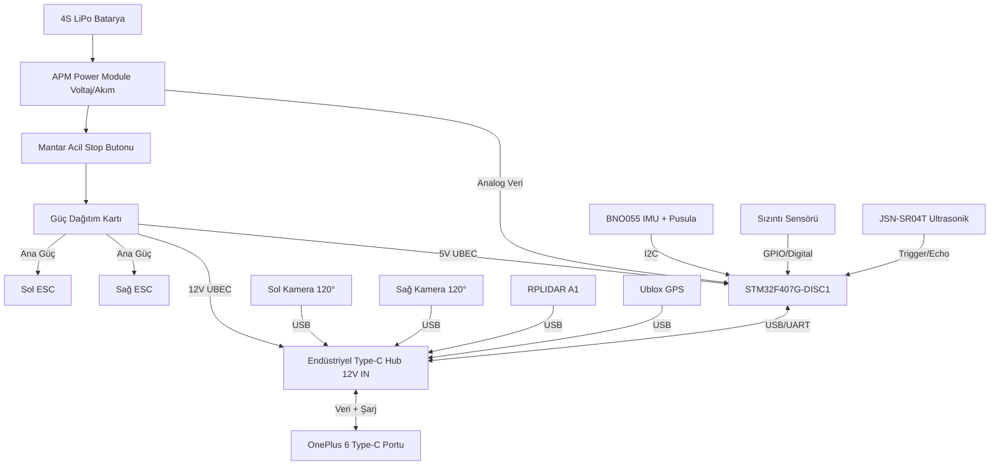

# TEKNOFEST 2026 İDA - Donanım ve Fiyat Analizi Raporu

Bu rapor, yazılım mimarimize (OnePlus 6 + STM32) ve TEKNOFEST şartnamesine tam uyumlu olacak şekilde, Türkiye'deki tedarikçilerden (Robotistan, Direnç.net, N11, Sahibinden vb.) temin edilebilecek en uygun ve en kaliteli elektronik malzemelerin fiyat/sistem analizini içermektedir.

> [!IMPORTANT]
> Fiyatlar Türkiye pazarındaki tahmini ortalama tutarlardır. OnePlus 6 gibi üretimden kalkmış cihazlar için ikinci el piyasası baz alınmıştır. Şartnameye göre arkada kalan 120 derece kör nokta bırakılarak, 240 derecelik ön görüş alanı için 2 adet 120° geniş açılı kamera kullanılmıştır.

---

## 1. Ana Malzeme Listesi ve Fiyat Analizi (BOM)

Aşağıdaki tabloda hem projenin çalışmasını sağlayacak **En Ucuz / Minimum Seçenekler** hem de yarışma şartlarında güvenilirlik sağlayacak **Önerilen / Kaliteli Seçenekler** karşılaştırılmıştır.

| No | Bileşen | Görevi / Şartname İsteri | En Ucuz Seçenek (Tahmini ₺) | Önerilen / Kaliteli Seçenek (Tahmini ₺) | Tedarikçi Önerisi |
|----|---------|-------------------------|----------------------------|-----------------------------------------|-------------------|
| 1 | **Ana Bilgisayar** | Yüksek Seviye Otonomi (Termux/Python) | OnePlus 6 (Kozmetik Çizikli, 64GB) - **2.500 ₺** | OnePlus 6 (Temiz, Bataryası Yeni, 128GB) - **4.000 ₺** | Sahibinden, EasyCep |
| 2 | **Mikrodenetleyici** | Düşük Seviye Kontrol ve Failsafe | STM32F401/F411 Black Pill Modül - **250 ₺** | **STM32F407G-DISC1** Orijinal Geliştirme Kartı - **1.300 ₺** | Robotistan, Direnç.net |
| 3 | **USB Çoğaltıcı (Hub)** | Telefona Kamera, GPS, STM32 bağlamak için | Standart Type-C OTG Hub (Beslemesiz) - **300 ₺** | **Endüstriyel 12V Beslemeli, Aktif Type-C Hub** - **2.000 ₺** | Amazon TR, AliExpress |
| 4 | **Kameralar (2 Adet)** | 240° Görüş Açısı (Yapay Zeka Tespiti) | 120° Geniş Açılı Çıplak USB Modül (720p) (2x) - **1.000 ₺** | 120° Geniş Açılı Metal Kasalı UVC USB Kamera (1080p) (2x) - **2.500 ₺** | Robotistan, N11 |
| 5 | **Motorlar (Thruster)** | İtki Sağlama (Diferansiyel Sürüş) | Çin Malı 12V 30A ROV Thruster (2x) - **2.000 ₺** | **Blue Robotics T200** (veya muadili yüksek kaliteli ROV) (2x) - **14.000 ₺** | Robitshop, Robotistan |
| 6 | **Motor Sürücü (ESC)** | Motorlara Çift Yönlü (İleri/Geri) Akım | 30A Çift Yönlü Fırçasız ESC (2x) - **600 ₺** | **Blue Robotics Basic ESC 50A** (2x) - **2.500 ₺** | Robotistan, N11 |
| 7 | **GPS / GNSS** | Konumlandırma | Ublox NEO-6M / M8N (Basit Anten) - **350 ₺** | **Ublox M8N veya M9N GPS + Pusula (Büyük Antenli)** - **1.200 ₺** | Direnç.net, Robotistan |
| 8 | **IMU (Atalet Sensörü)**| Dead Reckoning ve Yönelim Kontrolü | MPU6050 (Ekseni kolay kayar) - **100 ₺** | **BNO055 (Gelişmiş Sensör Füzyonu + Pusula)** - **700 ₺** | Robotistan, N11 |
| 9 | **Telemetri / RC** | Manuel Kontrol ve Veri Aktarımı | Standart 2.4GHz FlySky Kumanda - **1.500 ₺** | **Radiomaster Pocket ELRS 915MHz** - **2.800 ₺** | N11, Banggood |
| 10 | **Batarya (Güç)** | Tüm Sistemin Beslenmesi | 3S 5000mAh LiPo (Kısa Süreli Test) - **1.200 ₺** | **4S 10000mAh 25C+ Kaliteli LiPo** (Uzun Yarışma) - **3.500 ₺** | Robotistan, Pilburada |
| 11 | **Acil Durdurma** | Şartname Zorunluluğu (Motor Gücünü Keser)| Standart Mantar Başlı Buton (NC/NO) - **100 ₺** | Su Geçirmez IP67 Endüstriyel Acil Stop Butonu - **450 ₺** | Elektrik Marketleri |
| 12 | **Navigasyon Feneri** | Şartname Zorunluluğu (Kırmızı/Yeşil/Beyaz)| Basit 12V LED Şeritler - **100 ₺** | Denizcilik Standardı 12V Su Geçirmez LED Fenerler - **500 ₺** | Yat Malzemecileri |
| 13 | **Voltaj Regülatörleri**| 12V (Hub/Kamera) ve 5V (STM32) Düşürücü | LM2596 Step Down (Akım yetmeyebilir) - **150 ₺** | Yüksek Akımlı (5A-10A) Su Geçirmez UBEC / Step Down - **600 ₺** | Robotistan, N11 |

---

## 2. Önerilen Ekstra Emniyet ve Algılama Sensörleri

Gelişmiş otonomi seviyesine ulaşmak, su üzerindeki yansımalar nedeniyle kameraların kör kalmasını engellemek ve donanımı korumak için aşağıdaki ek sensörler şiddetle önerilir:

| No | Ekstra Sensör | Görevi / Projeye Katkısı | Fiyatı (Tahmini ₺) | Neden Eklemeliyiz? |
|----|---------------|-------------------------|--------------------|--------------------|
| E1 | **360° LIDAR (Örn: RPLIDAR A1)** | Çevresel Engel Algılama | **5.500 ₺** | Kameralar güneş yansıması, dalgalar veya renk değişiminde bazen dubaları kaçırabilir. LIDAR, costmap haritamızı milimetrik olarak besler ve otonom engelden kaçışı kusursuz hale getirir. |
| E2 | **Voltaj/Akım Sensörü (Power Module)** | Batarya Sağlığı Takibi (Failsafe) | **300 ₺** | Pil voltajı kritik seviyeye düştüğünde otonominin tekneyi otomatik olarak eve döndürmesini (`STATE_RETURN`) tetikler. |
| E3 | **Su Sızıntı Sensörü (Leak Sensor)** | Gövde İçi Güvenlik | **80 ₺** | Tekne su almaya başlarsa bunu anında algılayıp motorları kapatır ve kurtarma modunu açar. Binlerce liralık elektronik cihazları korur. |
| E4 | **Ultrasonik Mesafe Sensörü (JSN-SR04T)**| Su Geçirmez Ön Koruma/Mesafe Ölçümü | **390 ₺** | Tam teknenin burun ucuna takılır. Önündeki dubaya temas yapıldığını (Parkur 3 Kamikaze görevi) donanımsal olarak teyit eder. |

---

## 3. Pusula (Magnetometer) Durumu Hakkında Bilgilendirme

> [!NOTE]
> Projemiz için **Pusula (Magnetometer) zorunludur.** GPS tek başına yön bilgisini (heading) sadece İDA hareket halindeyken verebilir. İDA durduğunda veya rüzgarla sürüklendiğinde yönünü doğru saptayabilmek için mutlaka pusulaya ihtiyaç duyarız.

Raporda önerdiğimiz **BNO055 IMU** sensörü, içerisinde gömülü olarak **3 eksenli Pusula (Magnetometer)** barındırmaktadır. Kendi üzerindeki mikroişlemci sayesinde ivmeölçer, jiroskop ve pusula verilerini birleştirerek (Sensor Fusion) telefona doğrudan kararlı yönelim (Euler Açıları/Quaternion) çıktısı verir. 

Eğer daha ucuz bir alternatif tercih edilirse:
*   **Seçenek 1 (GPS Entegre Pusula):** Önerilen **Ublox M8N GPS** modülünün pusula entegreli versiyonu (içinde HMC5883L pusula çipi bulunur) tercih edilebilir. Bu durumda pusula verisi GPS kablosu üzerinden doğrudan STM32'ye gelir.
*   **Seçenek 2 (Ayrı Modül):** MPU6050 gibi pusulasız ucuz bir IMU tercih edilirse, yanına **QMC5883L** veya **HMC5883L** bağımsız dijital pusula modülü (~150 ₺) eklenerek STM32'ye I2C üzerinden bağlanmalıdır.

---

## 4. Güncellenmiş Mühendislik Tasarımı ve Bağlantı Şeması

Ekstra emniyet ve algılama sensörleri sisteme eklendiğinde bağlantı yapısı şu şekilde güncellenmektedir:

> [!TIP]
> **Önemli Emniyet Notu:** Batarya voltaj/akım takibi, sızıntı sensörü ve su geçirmez mesafe sensörleri doğrudan STM32'nin donanımsal pinlerine bağlanarak en düşük gecikmeyle (yazılımdan bağımsız, kesme/interrupt mantığı ile) failsafe senaryolarını tetikler. Bu sayede otonom yazılımda kilitlenme olsa dahi tekne fiziksel donanımlarını ve pillerini korumuş olur.
